# vLLM GWM — Implementation Guide

How the Graph World Model (GWM) extension works end to end: the idea of
discovering workflows from past trajectories, the artifacts that come out of
that discovery, and how the vLLM plugin uses them at serve time to advise,
select, collect, and self-evolve.

Companion docs: [README.md](README.md) (install/quick start),
[examples.md](examples.md) (runnable scripts),
[SYNC.md](SYNC.md) (vendored-file provenance).

---

## 1. The core idea

An LLM agent solving a multi-step tool-using task (CRM lookups, EnterpriseOps
tickets, Toucan JSON tool calls) follows an implicit *workflow*: it probes,
acts, reads results, and eventually answers. Across thousands of rollouts the
same shapes recur — "just described the schema", "third failed `execute` in a
row", "answered without verifying". Some of those shapes are strongly
predictive of failure.

GWM makes that workflow explicit:

1. **Discover** the workflow states by embedding trajectory prefixes and
   clustering them (unsupervised — no hand-written state machine).
2. **Mine** a transition graph over those states: `P(next state)`, per-state
   success rate, per-(state, action) success rate, and *trap states* whose
   failure rate is far above the domain base.
3. **Serve** the graph as a *world model*: classify the live conversation to a
   state, look up what has historically worked from there, and either
   - **advise** the policy model with one short, grounded hint (k=1), or
   - **select** the best of K candidate continuations (k>1).
4. **Collect** new rollouts produced under the served model, label them, and
   periodically **rebuild** the graph so it tracks the deployed policy.

The graph is packaged as a LoRA-like **graph adapter** bundle and loaded by
name at launch; the policy model itself is never modified. The judge/advisor
LLM is the *same served model*, called through a bypass so it never recurses
back into GWM.

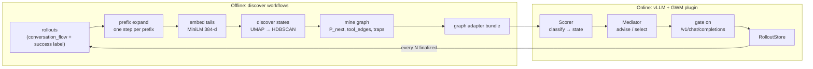

---

## 2. Vocabulary

| Term | Meaning | Where |
|------|---------|-------|
| **conversation_flow** | Canonical trajectory event list: `system_message`, `user_message`, `ai_message{content, tool_calls}`, `tool_result{tool_name, result}`, optional `task_metadata`, `tools`. Shared by mining and serving. | `collect/flow.py`, `harness/render.py` |
| **step / prefix** | One `ai_message` together with everything before it. Mining classifies *prefixes*, so a state describes "where the agent is right now". | `benchmarks/wm/lib/prefix_expand.py` |
| **state** | A cluster id such as `crm:12` or `toy:0`; `<domain>:<cluster>`. | `centroid_meta.json → state_ids` |
| **centroid** | Normalized 384-d mean embedding of a state's training steps. Live classification is cosine nearest-neighbour against these. | `out/centroids/centroids_384.npy` |
| **p90 / abstain** | Per-state 90th-percentile train distance. If the live tail is farther than `p90[s] * p90_scale`, the classifier abstains (`state=None`, `UNKNOWN`). | `centroid_meta.json → p90`, `Scorer.classify` |
| **trap state** | `fail_rate / base_fail_rate >= 1.3` and `n_rollouts >= 20`. Triggers advice. | `Scorer.__init__` |
| **tool_edges** | For each state, per-toolset: `n`, `succ`, `p_action`, `next{state: p}`. The action table the advisor reads. | `transitions.json` |
| **graph adapter** | Versioned bundle dir with `MANIFEST.json`, `reports/transitions.json`, `out/centroids/*`, optional `reports/examples.json`. | `runtime/adapter.py` |
| **preset** | TOML mapping a benchmark family (crm/eops/toucan) to `HarnessConfig` knobs, default graph/domain, flow shaping. | `presets/*.toml` |
| **Scorer** | Owns graph + centroids + MiniLM; classifies flows, exposes `succ`, `lift`, `trap`, `top_tool`. | `harness/graph_sidecar.py` |
| **Mediator** | The harness agent: decides whether to intervene, runs the graph tool-loop with the LLM, ranks candidates. | `harness/harness.py` |
| **episode** | Caller-provided id (`gwm.episode_id`) tying multi-turn requests to one rollout; also keys the per-episode advice budget. | `harness.episode_key` |

---

## 3. Discovering workflows (graph build)

Stages 1–7 of the canonical `benchmarks/wm/build_all.sh` DAG (below) are ported
into `src/vllm_gwm/build/mining/`, one module per stage, orchestrated by
`src/vllm_gwm/build/pipeline.py::build_graph` (per-module provenance in
[SYNC.md](SYNC.md)). Stage 0 (harvest) stays benchmark-specific: the pipeline
starts from `out/rollouts*.jsonl.gz`, and `pipeline.ingest_rollouts()` bridges
the plugin's own collected rollouts into that shape. `vllm-gwm build`,
`EvolveManager` and `scripts/build_graph.sh` all call `build_graph` — nothing
shells out to the benchmarks repo, and the `[build]` extras
(umap/hdbscan/sklearn/sentence-transformers) are imported inside the stages that
need them, never at package import.

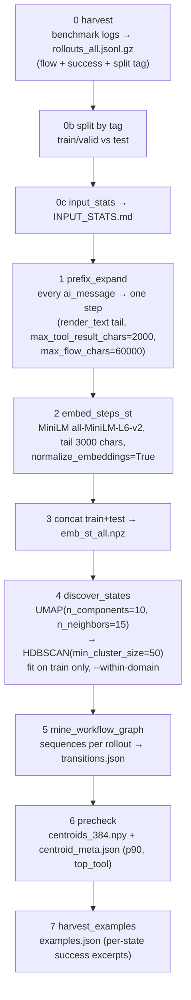

### 3.1 Why prefixes, why tails

A state must be computable *mid-episode* at serve time, so mining embeds the
same thing serving will embed: the rendered trajectory so far, truncated to
its last `tail_chars` (3000). `render.render_text` flattens events to a stable
textual form and `scrub.py` removes benchmark-specific identifiers so
clusters encode *what the agent is doing*, not *which record it is doing it
to*.

### 3.2 State discovery

UMAP reduces the 384-d embeddings to ~10 dims, HDBSCAN finds density
clusters; points HDBSCAN cannot place become `noise` (excluded from
centroids). `--within-domain` clusters each benchmark domain separately so
state ids are `<domain>:<k>`. `discover_states.py` also reports normalized
mutual information between cluster id and `{domain, step position, outcome}`
— if position dominates outcome, the "states" are just trajectory depth and
the build should be tuned.

### 3.3 Mining the transition graph

For each domain `mine_workflow_graph.py` walks every rollout's state sequence
(`START → s1 → s2 → … → END`) and emits one block:

```jsonc
{
  "<domain>": {
    "n_rollouts": 812,
    "base_fail_rate": 0.31,
    "P_next":      { "<s>": { "<s'>": 0.62, "...": 0.38 } },
    "state_fail":  [ { "state": "<s>", "n_rollouts": 40, "fail_rate": 0.72, "lift": 2.3 } ],
    "trans_fail":  [ { "from": "<s>", "to": "<s'>", "n": 17, "fail_rate": 0.8, "lift": 2.6, "self_loop": false } ],
    "divergence":  [ { "state": "<s>", "tv": 0.41, "visits": 120 } ],
    "tool_edges":  { "<s>": { "execute": { "n": 12, "succ": 0.10, "p_action": 0.7, "next": { "<s>": 0.8 } },
                              "describe": { "n": 8,  "succ": 0.70, "p_action": 0.3, "next": { "<s'>": 0.9 } } } }
  }
}
```

- `state_fail` is sorted by `lift * n_rollouts` — the most damaging,
  best-supported states first.
- `divergence.tv` is the total-variation distance between the next-state
  distribution of successful vs failed rollouts leaving that state: high `tv`
  means *what you do here decides the outcome*.
- `tool_edges` keys are `|`-joined sorted tool names of one `ai_message`
  (`""` = finishing without a tool). This is what makes advice actionable:
  the advisor can say "from here `describe` succeeded 70% vs `execute` 10%".

### 3.4 Centroids and abstention (`precheck`)

Per state: mean of member embeddings (re-normalized) and the 90th percentile
of member cosine distances to that mean. At serve time
`Scorer.classify` returns `(state, dist)` when `dist <= p90[state] *
p90_scale` and `(None, dist)` otherwise. Abstaining is a feature: a graph
mined on CRM should not confidently label an unrelated conversation.
`unify_domains=True` (Toucan preset) ranks against *all* centroids and
resolves guidance from the matched state's home domain, for out-of-domain
graphs.

### 3.5 Examples

`harvest_examples.py` stores up to `--per` (20) successful excerpts per state
so the advisor can answer `find_similar` / `success_example` with concrete
past behaviour instead of statistics. The EOPS examples file is 188 MB and
is fetched, not committed (`examples/fetch_graphs.sh`).

---

## 4. Graph adapter bundle

```
<adapter>/
  MANIFEST.json                      # adapter, version, files{rel: {sha256}}, build metadata
  reports/transitions.json           # §3.3
  out/centroids/centroids_384.npy    # float32 [n_states, 384]
  out/centroids/centroid_meta.json   # state_ids, p90, top_tool, model, tail_chars,
                                     # max_tool_result_chars, max_flow_chars
  reports/examples.json              # optional; {domain: {states: {sid: [{text}]}}}
```

`GraphAdapter.validate()` (`runtime/adapter.py`):

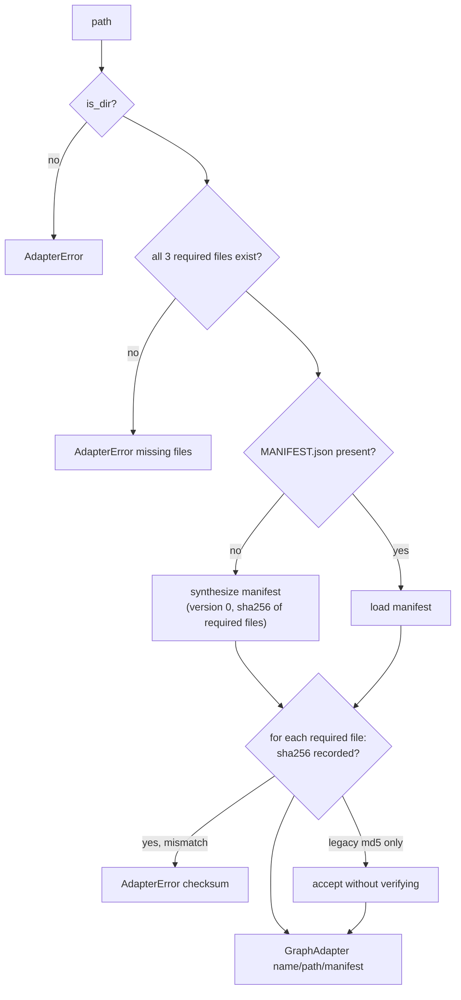

Security rule: inference requests may only reference **registered names**.
`GraphAdapter.resolve_path` accepts an absolute path only if it lies under a
registered root; anything else raises. Clients cannot point the server at an
arbitrary directory.

---

## 5. Runtime architecture

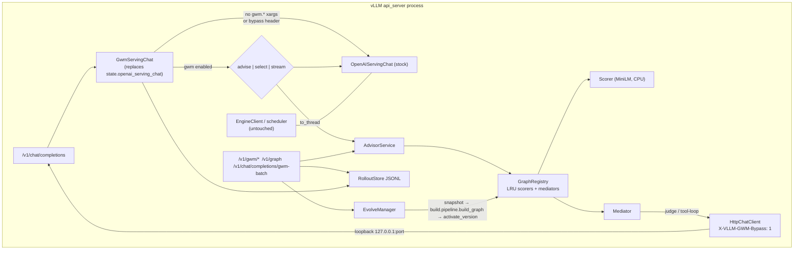

### 5.1 Plugin bootstrap (`plugin.py`)

vLLM discovers `GwmEndpointPlugin` via the `vllm.endpoint_plugins` entry
point when `VLLM_PLUGINS=gwm`. Two hooks:

- `attach_router(app)` — registers `/v1/gwm/{info,graphs,advise,select,
  feedback,builds,rollback}`, `/v1/graph*` (viewer, opt-in), and
  `/v1/chat/completions/gwm-batch`.
- `init_state(engine_client, state, args)`:

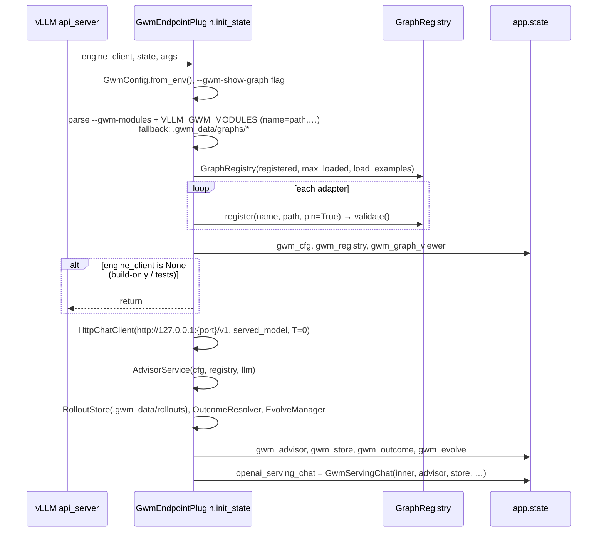

Nothing in vLLM core is modified: the proxy is a duck-typed wrapper
(`__getattr__` forwards everything else to the stock handler).

### 5.2 Same-model bypass (`runtime/engine_chat.py`)

The Mediator's judge/advisor LLM is the served model itself. To avoid
recursion (GWM gating its own judge calls) two markers exist:

- **HTTP**: `HttpChatClient` posts to the same port with
  `X-VLLM-GWM-Bypass: 1`; `GwmServingChat.create_chat_completion` checks
  `is_http_bypass(headers)` first and delegates straight to the stock handler.
- **In-process**: `bypass_context()` sets `contextvars` (`gwm_bypass`,
  `gwm_depth`) used by `EngineChatClient`/`GWMLLM` for the offline path.

Judge calls are executed via `asyncio.to_thread` because the loopback
request must be served by the same event loop that is awaiting it.

---

## 6. Request lifecycle

### 6.1 Dispatch

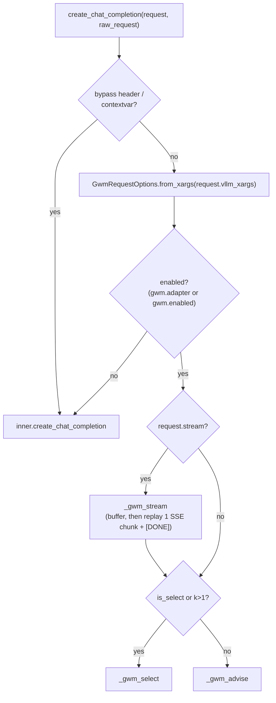

`GwmRequestOptions` (`protocol.py`) reads either flat `gwm.*` keys (required
over HTTP — vLLM validates `vllm_xargs` as flat scalars) or a nested `gwm`
dict (in-process). `mode` resolves as: `select` → select, `advise` → advise,
`auto` → select iff `k > 1`.

### 6.2 Advise loop (k = 1)

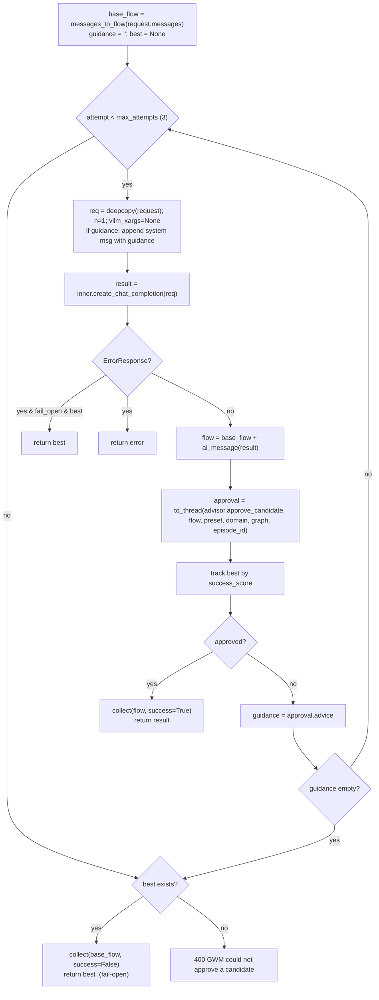

`approve_candidate` is a thin adapter over `Mediator.advise`: a candidate is
**approved** when the mediator produced no guidance (`injected=False`) and
no error. When it does produce a `[World-Model guidance]` block, that block
is injected as a hidden system message and the policy regenerates. Because
the Mediator is deliberately sparse (§7.1), most requests are approved on
attempt 1 with a single extra CPU classification and no judge LLM call.

### 6.3 Select (k > 1)

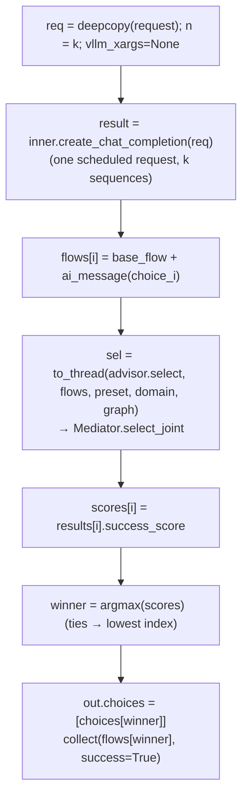

Usage reported to the client is the stock `n=k` usage; judge tokens are
separate and appear in the harness log/`harness` block, not in the response.

### 6.4 Streaming

GWM must approve a *complete* candidate before any token leaves the server,
so `_gwm_stream` runs the non-stream path and replays the approved text as
one `chat.completion.chunk` followed by `data: [DONE]`. TTFT therefore equals
full generation + judge latency.

### 6.5 Batch (`/v1/chat/completions/gwm-batch`)

`{"requests": [ChatCompletionRequest, …]}` → runs each through the proxy
under an `asyncio.Semaphore(max_concurrent_gwm)`, forces `mode=select` when
`k>1`, preserves ordering, isolates per-entry errors, and reports
`policy_candidates = Σ k`. `B=10, K=10` therefore schedules 100 policy
sequences (plus judge calls, accounted separately).

### 6.6 Offline (`offline.py`)

`GWMLLM(llm, registry).chat(GWMRequest)` composes over `vllm.LLM` with the
in-process `EngineChatClient` bypass. It mirrors advise/select semantics but
is not yet at parity with the serving state machine (no retry loop).

---

## 7. Mediator internals (`harness/harness.py`)

### 7.1 `advise(flow, domain)` — decide, ground, compose, validate

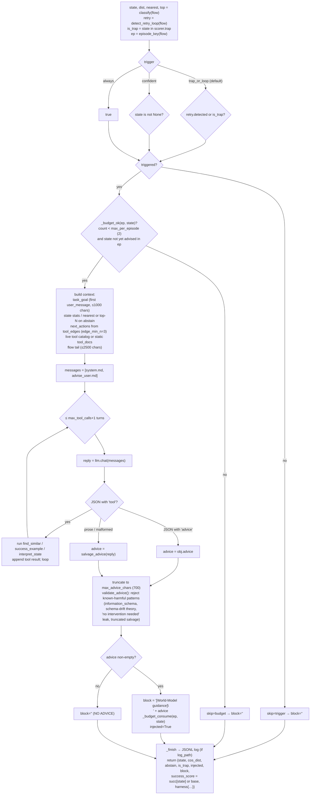

Key design points, each backed by a measured failure in the upstream
diagnosis docs:

- **Sparse by default.** Advice hurts when it is generic. The default
  trigger fires only on a known trap state or a live retry loop.
- **Retry-loop detection is classifier-independent.** `detect_retry_loop`
  fires only when the tail shows ≥3 consecutive failing calls of the same
  toolset with an identical result digest (or ≥3 identical results among the
  last 4 same-toolset calls). Two *different* failures while probing a schema
  are normal and must not trigger.
- **Budgets.** At most `max_per_episode` interventions, never twice for the
  same `(episode, state)` — including `state=None`.
- **Grounding tools, not free association.** The advisor can only call three
  graph tools; the system prompt forbids inventing tools/identifiers.
- **Validation over trust.** Known-harmful advice shapes are dropped to
  NO ADVICE rather than injected.

### 7.2 `select_joint(flows, domain)` — comparative best-of-K

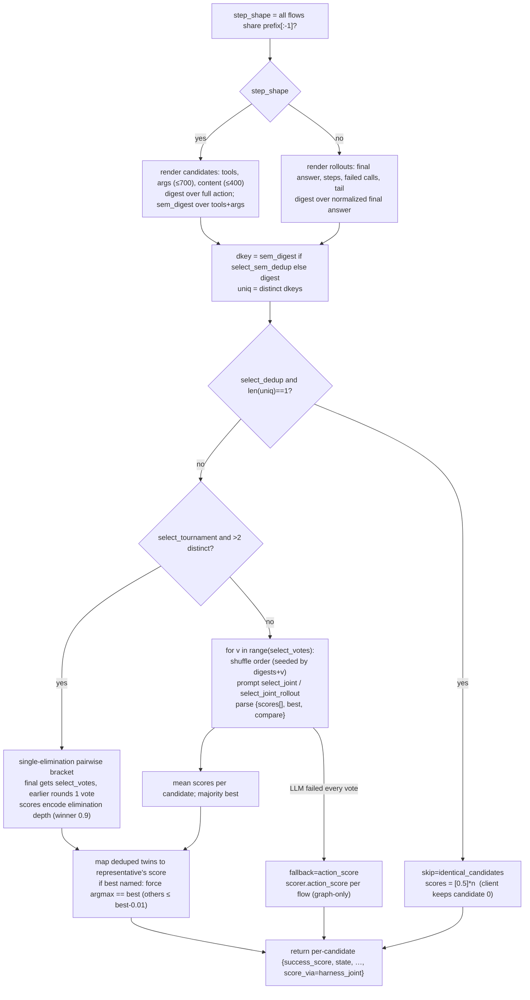

Two shapes are auto-detected: **step mode** (EnterpriseOps `wm_react`:
shared prefix, compare next actions) and **rollout mode** (CRM: K whole
rollouts, compare final answers). `select_single` scores one whole rollout
with a 0–1 rubric and falls back to the state's historical success value if
the judge is unparseable; `OutcomeResolver` uses it as the implicit judge.

---

## 8. Registry, caching, versioning (`runtime/registry.py`)

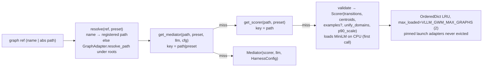

- Scorers and mediators are cached separately; several presets can share one
  scorer.
- `activate_version(name, version_path)` validates the new bundle, writes
  `<root>/current.json` via temp-file + `os.replace`, then drops cached
  scorer/mediators for that path so the next request loads the new version.
  A failed validation leaves the active graph untouched.
- `POST /v1/gwm/rollback {adapter, version_path}` is the same call pointed at
  an earlier version directory.

---

## 9. Collect → label → evolve

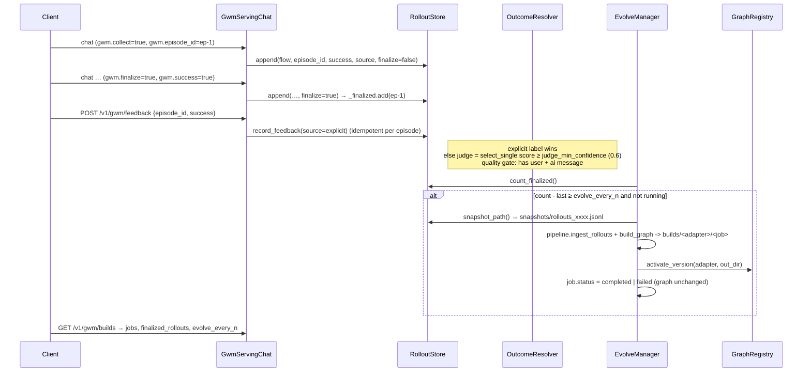

Collection is off unless `gwm.collect=true` on the request or
`VLLM_GWM_COLLECT=all`. Only *finalized* episodes count toward the evolve
threshold; unfinished conversations are never mined. Today
`EvolveManager.maybe_trigger()` is callable but not yet wired into the serving
path on every finalize, and finalized counters live in memory (see PLAN.md
§5–6 gaps).

### 9.1 Toucan flow shaping

Presets can declare `flow_style = "toucan"`. `shape_flow` then rewrites the
transcript through `harvest_toucan_flow`: keep the bare question extracted
from the Green prompt (`Task / user question: … Available tools:`), drop
system prompts and tool-catalog blobs (which always classify as UNKNOWN),
and parse assistant JSON `{"name", "arguments"}` text into `tool_calls`. The
same function is used when harvesting Toucan rollouts for mining, so serve-
time classification sees exactly the shape the centroids were built from.

---

## 10. Configuration surfaces

### 10.1 Launch (env / CLI)

| Env | Default | Effect |
|-----|---------|--------|
| `VLLM_PLUGINS` | — | must include `gwm` |
| `VLLM_GWM_MODULES` | — | `name=/abs/path,…`; also `--gwm-modules` via `vllm-gwm serve` |
| `VLLM_GWM_DATA_ROOT` | `.gwm_data` | rollouts, snapshots, builds, logs, fallback graphs |
| `VLLM_GWM_PRESET_DEFAULT` / `_PRESET_DIR` | `crm` / — | default preset; extra preset search dir |
| `VLLM_GWM_MAX_GRAPHS` | 2 | LRU size for scorers/mediators |
| `VLLM_GWM_LOAD_EXAMPLES` | 1 | load `examples.json` if present |
| `VLLM_GWM_FAIL_OPEN` | 1 | return best candidate on judge/graph failure |
| `VLLM_GWM_MAX_ATTEMPTS` | 3 | advise regenerate cap |
| `VLLM_GWM_MAX_CONCURRENT` | 4 | batch semaphore |
| `VLLM_GWM_COLLECT` | `opt_in` | `off` / `opt_in` / `all` |
| `VLLM_GWM_EVOLVE_EVERY` | 0 (off) | finalized rollouts per rebuild |
| `VLLM_GWM_JUDGE`, `_JUDGE_MIN_CONF` | 1, 0.6 | implicit outcome judge |
| `VLLM_GWM_AUDIT_LOG` | 0 | write mediator JSONL to `logs/gwm_<preset>.jsonl` |
| `VLLM_GWM_SHOW_GRAPH` | 0 | serve `/v1/graph` viewer |
| `VLLM_GWM_TRIGGER`, `_MAX_PER_EPISODE`, `_MAX_TOOL_CALLS`, `_MAX_ADVICE_CHARS`, `_TOPN_STATES`, `_EDGE_MIN_N`, `_SELECT_VOTES`, `_SELECT_SEM_DEDUP` | preset | `HarnessConfig` overrides applied on top of the preset |

### 10.2 Per request (`vllm_xargs`)

| Key | Type | Effect |
|-----|------|--------|
| `gwm.adapter` | str | registered graph name; enables GWM |
| `gwm.mode` | `advise` \| `select` \| `auto` | gate type (`auto`: select iff k>1) |
| `gwm.k` | int ≥1 | candidates for select; GWM sets inner `n=k` |
| `gwm.preset` | str | preset name (default `VLLM_GWM_PRESET_DEFAULT`) |
| `gwm.domain` | str | graph domain; default preset's, else first in graph |
| `gwm.episode_id` | str | rollout / advice-budget key |
| `gwm.collect`, `gwm.finalize` | bool | write rollout; close episode |
| `gwm.success`, `gwm.outcome_source` | bool, str | explicit label carried with the rollout |

### 10.3 Presets (`presets/*.toml`)

`[preset]` → `default_graph`, `default_domain`, `unify_domains`,
`p90_scale`, `flow_style`, `scrub_config`. `[harness]` → any `HarnessConfig`
field (`action_space`, `advice_rules`, `select_sem_dedup`,
`select_examples`, `select_tail_chars`, `log_candidates`, …). Unknown keys
raise `PresetError` at load time.

---

## 11. On-disk layout

```
.gwm_data/                       # VLLM_GWM_DATA_ROOT
  graphs/<name>/                 # `vllm-gwm import`; auto-registered if no modules given
    current.json                 # {"path": <active version dir>} written by activate_version
  rollouts/
    rollouts.jsonl               # {id, episode_id, flow, success, source, finalized}
    feedback.jsonl               # {episode_id, success, source}
    snapshots/rollouts_<hex>.jsonl
  builds/<adapter>/<job_id>/     # versioned bundle produced by a build
  logs/gwm_<preset>.jsonl        # mediator decisions (audit_log=1)
  live_e2e_report.json, vllm_live.log   # from scripts/live_smoke.sh
```

---

## 12. Failure modes and guarantees

| Situation | Behaviour |
|-----------|-----------|
| Graph missing / checksum mismatch | `AdapterError` at register or first load; `/v1/gwm/graphs` reports `valid=false` |
| Unregistered adapter name / path outside roots | `GraphError`/`AdapterError` → `AdvisorService` returns `_error_result` (abstain, `success_score=0`) → candidate not approved → fail-open returns best |
| Judge LLM error or unparseable JSON | `select_joint` → graph-only `action_score`; `select_single` → state value; `advise` → salvage prose or NO ADVICE |
| Classifier abstains | advise: trigger may still fire on retry loop; context uses nearest / top-N states labelled LOW CONFIDENCE |
| Policy generation error mid-advise | fail-open returns best completed candidate if any, else the error |
| Build fails | job `failed`, active graph untouched |
| Stock request, no `gwm.*` | byte-identical delegation to `OpenAIServingChat` |

Costs to be explicit about with operators: advise adds one CPU MiniLM
classification per attempt (~30 ms warm, ~5 s cold) and, when triggered, up
to `max_tool_calls+1` same-model judge generations; select adds `n=k`
sequences plus `select_votes` judge calls; streaming is buffered.

---

## 13. Status at a glance

Done: plugin wrapping, advise/select/stream/batch gates, registry with LRU
and atomic `activate_version`, vendored benchmark harness with semantic dedup,
CRM/EOPS/Toucan presets, JSONL collection and explicit feedback, evolve
skeleton, the ported mining pipeline (`build/mining/*` + `build/pipeline.py`),
`/v1/graph` viewer, 11+ CPU tests, offline e2e.

Not yet: evolve trigger wired on finalize with durable counters, `X-GWM-*` response
metadata, fail-closed HTTP paths, in-process engine client for live serving.
See [PLAN.md](PLAN.md) "Outstanding work".

---

## 14. Extending

- **New benchmark family**: add `presets/<name>.toml`; if the transcript
  needs reshaping add a `flow_style` branch in `collect/flow.py::shape_flow`
  and mine graphs from the same shaped flows.
- **New graph**: build or fetch a bundle, `vllm-gwm inspect <dir>`, then
  register with `--gwm-modules name=/abs/dir` (or `vllm-gwm import`).
- **Changing a mining stage**: edit the module under
  `src/vllm_gwm/build/mining/`, add it to `pipeline.STAGES` if it is new,
  keep the `conversation_flow` schema and `transitions.json` keys of §3.3,
  and keep `[build]` extras (umap/hdbscan/sklearn/sentence-transformers) out
  of the default import path (`mining/_deps.py::lazy_import`).
- **Tuning the mediator**: prefer preset `[harness]` keys or `VLLM_GWM_*`
  overrides over editing vendored `harness/harness.py`; record any harness
  change in [SYNC.md](SYNC.md).
