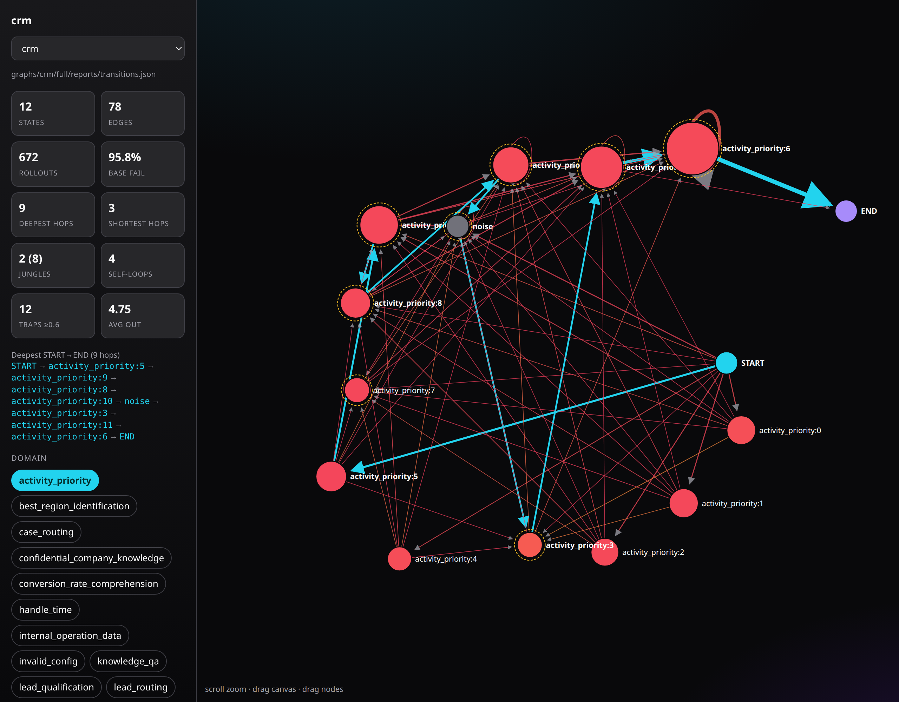

# vLLM Graph World Model (GWM) extension

Installable endpoint plugin for vLLM that loads LoRA-like **graph adapter**
bundles, gates generations through **GWM as advice+selector when K>1**,
collects rollouts, and optionally **self-evolves** the graph after N finalized
episodes.



*The built-in `/v1/graph` viewer rendering a mined transition graph — states,
trap edges (red), the deepest START→END path (cyan), and per-domain filtering.
Enable it with `--gwm-show-graph`.*

## Install

This is a standalone package installed alongside a stock `vllm`. It requires no
changes to vLLM core — it plugs in through vLLM's public `vllm.endpoint_plugins`
entry point.

```bash
# from the repository root
python3 -m venv .venv
.venv/bin/pip install -e ".[test]"
# optional classifier / mining extras
.venv/bin/pip install -e ".[model,build]"
```

Install `vllm` in the same environment, then start it. vLLM discovers the plugin
through the `vllm.endpoint_plugins` entry point.

## Quick start

```bash
export VLLM_PLUGINS=gwm
vllm serve google/gemma-4-E2B-it \
  --gwm-modules eops=/path/to/graphs/eops/full \
  --gwm-modules crm=/path/to/graphs/crm/full
```

Enable GWM on a request via `vllm_xargs`:

```json
{
  "model": "google/gemma-4-E2B-it",
  "messages": [{"role": "user", "content": "..."}],
  "vllm_xargs": {
    "gwm": {
      "adapter": "eops",
      "mode": "advise",
      "k": 1,
      "episode_id": "ep-1"
    }
  }
}
```

## Best-of-K select tuning (env / preset)

These `VLLM_GWM_*` env vars tune the `mode="select"` best-of-K path. All are
**default-off** (behaviour unchanged unless set); a preset may enable a
validated default per benchmark.

| Env | Default | Effect |
|---|---|---|
| `VLLM_GWM_GREEDY_ANCHOR` | `0` | Draw candidate 0 at temperature=0 (greedy) and 1..k-1 at the request temperature, pinning the greedy sample at index 0. On identical/low-margin steps the select arm then degrades to greedy (base) behaviour instead of returning a temperature sample. |
| `VLLM_GWM_SELECT_MIN_MARGIN` | `0.0` | Keep candidate 0 unless the judge's winner beats it by ≥ this score margin — suppresses low-margin coin-flip overrides. Best paired with the greedy anchor. |
| `VLLM_GWM_SELECT_EXAMPLES` | preset (`0`) | Number of successful past-trajectory exemplars shown to the judge at the classified state. |
| `VLLM_GWM_SELECT_NEG_EXAMPLES` | `0` | Number of contrastive **step-labeled** negative exemplars (actions that errored at this state) shown to the judge as "failed attempts here". |
| `VLLM_GWM_SELECT_VOTES` | `1` | Judge votes over reshuffled candidate orders; majority `best` / mean scores. |
| `VLLM_GWM_SELECT_TOURNAMENT` | `0` | Single-elimination pairwise bracket instead of one K-way judge call (helps at large K where K-way judging saturates). |
| `VLLM_GWM_SELECT_SEM_DEDUP` | preset | Dedup candidates on the tool call (name+args) only, ignoring free text / whitespace. |

**Preset defaults.** A preset TOML may ship a validated config: `greedy_anchor`
under `[preset]`, and any `HarnessConfig` field (e.g. `select_min_margin`,
`select_examples`) under `[harness]`. The global env switch is OR-ed with the
preset's `greedy_anchor`. The bundled **`toucan`** preset ships the validated
winner (`greedy_anchor = true`, `select_min_margin = 0.2`): on Qwen3.6
`toucan_100_test` this converts a −5 best-of-K regression into a reproducible +4
over greedy base (55 → mean 59). `crm` / `eops` are unchanged (anchor off).

## Self-evolving graph (accretion + state minting)

The graph is normally mined offline and read-only at serve time. These flags let
it grow **in place** from the policy's own live rollouts — no re-clustering, no
directory swap, and no outcome/reward channel.

| Env | Default | Effect |
|---|---|---|
| `VLLM_GWM_ACCRETE_SELF` | `0` | Prepend the judge-selected action at the classified state to that state's exemplar list, so later steps at the same state see the policy's own recent behaviour as evidence. Applied *after* the decision, so a step never influences itself. |
| `VLLM_GWM_MINT_STATES` | `0` | On abstain, greedy leader-cluster the embedding against previously minted centroids: attach if within radius, else append a new centroid. Converts recurring UNKNOWN states into classifiable ones. |
| `VLLM_GWM_ACCRETE_MAX_PER_STATE` | `8` | Ring-buffer cap on **accreted** entries per state. Mined exemplars are never evicted. |
| `VLLM_GWM_MINT_MIN_SUPPORT` | `3` | A minted state stays invisible to the classifier until it has been visited this many times, so a one-off state cannot speak. |
| `VLLM_GWM_MINT_RADIUS` | `0` | Attach radius for minted centroids; `0` uses the graph's own median P90, so a minted state is no more permissive than a mined one. |
| `VLLM_GWM_ACCRETE_SCOPE` | `global` | `global` carries evidence across episodes (**transductive** — later tasks benefit from earlier ones; report it as such). `episode` purges all accreted evidence between episodes (inductive control). |

Counters are exposed on `GET /v1/gwm/info` under `accrete.stats` and, with
`VLLM_GWM_AUDIT_LOG=1`, snapshotted to `<data_root>/accrete/<adapter>.json`.

**No outcome signal is consumed, deliberately.** On a teacher-forced replay
benchmark (Toucan) the only correctness signal available at eval time is the
gold action, and accreting on it would be training on test labels. Accretion is
therefore self-referential: it changes *what evidence the judge sees*, not what
it is told is correct. On a genuinely executing benchmark, outcome-gated
accretion is the natural extension.

## Periodic rebuild (`EvolveManager`)

`VLLM_GWM_EVOLVE_EVERY=N` triggers a background rebuild after N finalized
rollouts, then `activate_version()` swaps the bundle atomically. The rebuild
runs the real mining DAG in-process (`vllm_gwm.build.pipeline.build_graph`:
prefix_expand → embed → concat → discover → mine → precheck → examples), so it
needs the `[build]` extra (`umap-learn`, `hdbscan`, `scikit-learn`,
`sentence-transformers`). A failing build **fails closed** — the previously
active bundle stays active; the 1-state placeholder
(`VLLM_GWM_EVOLVE_ALLOW_MINIMAL=1`) is opt-in for tests only.

| Env | Default | Effect |
|---|---|---|
| `VLLM_GWM_BUILD_EMBED_MODEL` | pipeline default (MiniLM) | embedder for evolve builds |
| `VLLM_GWM_BUILD_EMBED_DEVICE` | `cpu` | the GPU is busy serving |
| `VLLM_GWM_BUILD_WATCHED_TOOLS` | — | tools the precheck gates track |

The same pipeline backs `vllm-gwm build --input rollouts.jsonl --adapter <name>`
and `scripts/build_graph.sh` (a thin wrapper over
`python -m vllm_gwm.build.pipeline`).

## Embedding model (state classifier)

The serve-time classifier embeds the live flow and takes the cosine-nearest
centroid, so **it must use the same embedder that built the graph**. That model
id is recorded in the bundle's `centroid_meta.json` (`model`, `dim`) and is
loaded from there — you do not configure it per-request. The centroid matrix is
named for its dimension (`centroids_384.npy` for MiniLM, `centroids_4096.npy`
for a 4096-d embedder) and is discovered by glob, so any dimension works.

| Env | Default | Effect |
|---|---|---|
| `VLLM_GWM_EMBED_DEVICE` | `cpu` | Device for the embedder. MiniLM is fine on CPU; a multi-billion-parameter embedder is not usable there at per-step latency, so point it at a GPU (`cuda:0`) and lower `--gpu-memory-utilization` to leave room beside the policy weights. |
| `VLLM_GWM_EMBED_TRUST_REMOTE_CODE` | `0` | Pass `trust_remote_code=True` when loading. Required by embedders that ship custom modelling code; opt-in by design. |

A mismatch between the embedder's output dimension and the graph's centroids
raises at load rather than silently classifying in the wrong space.

## Graph adapter layout

```
<adapter>/
  MANIFEST.json
  reports/transitions.json
  out/centroids/centroids_<dim>.npy
  out/centroids/centroid_meta.json
  reports/examples.json   # optional
```

## Admin routes

- `GET /v1/gwm/info`
- `GET /v1/gwm/graphs`
- `GET /v1/gwm/stats` — cumulative harness usage per loaded mediator (events, judged/skipped, unknown-state count, LLM calls/tokens, overrides, fallbacks, latency)
- `POST /v1/gwm/advise`
- `POST /v1/gwm/select`
- `POST /v1/gwm/feedback`
- `GET /v1/gwm/builds`
- `POST /v1/gwm/rollback`
- `POST /v1/chat/completions/gwm-batch`
- `GET /v1/graph` — interactive transition-graph viewer (opt-in)

Enable the viewer with `--gwm-show-graph` (or `VLLM_GWM_SHOW_GRAPH=1`). It
renders the adapters registered via `--gwm-modules`:

```bash
vllm-gwm serve --gwm-show-graph --gwm-modules crm=$(pwd)/graphs/crm/full MODEL
# then open http://127.0.0.1:8000/v1/graph
```

## Tests

```bash
pytest -m "not model" -q
```

GPU integration smokes (physical slot 1):

```bash
CUDA_VISIBLE_DEVICES=1 pytest -m gpu -q
```

## Live three-mode evaluation

See [docs/three_mode_live.md](docs/three_mode_live.md) for running the frozen,
build-from-ratio, and self-evolve modes against a live server, with reference
results.

## Provenance

See [SYNC.md](SYNC.md) for vendored harness sources.

## API backend (no local vLLM)

Serve GWM against any OpenAI-compatible API — no GPU engine required:

```bash
pip install -e ".[server,model]"

export OPENAI_API_KEY=...
vllm-gwm serve --backend api \
  --api-base https://api.openai.com/v1 \
  --model gpt-4o \
  --gwm-modules crm=$(pwd)/graphs/crm/full
```

Key flags: `--backend api`, `--api-base`, `--model`, `--judge-api-base`,
`VLLM_GWM_API_MAX_TOKENS`, `VLLM_GWM_API_MAX_RETRIES`,
`VLLM_GWM_API_RETRY_STEP_SEC`, `VLLM_GWM_API_QUOTA_SLOW_PERCENT`.

Notes on OpenAI-compatible backends:

- Backends without native `n` are emulated by `OpenAIAPI` looping.
- If the backend does not honour `temperature`/`top_p`/`seed`, the
  `greedy_anchor` best-of-K arm is effectively inert (`select_min_margin` still
  applies) and best-of-K may see identical candidates on most steps.
- `response_format`, `stop`, `seed`, `user`, `tools` and `tool_choice` are
  forwarded verbatim from the request.
- A low `max_tokens` cap can truncate verbose agent replies mid-JSON; raise
  `VLLM_GWM_API_MAX_TOKENS` for long answers.

## Examples

See [examples.md](examples.md) for runnable scripts, **Toucan live logs** (GPU 1
`:8497`, Gemma4 / Qwen3.6), curl samples, and env reference.

## Implementation

See [IMPLEMENTATION.md](IMPLEMENTATION.md) for how GWM discovers workflows,
the graph adapter format, request lifecycle flowcharts, and the
collect → label → evolve loop.
